## [Kefitzat haderech](https://en.wikipedia.org/wiki/Kefitzat_haderech)

This is a repository for the code and images relating to a simulation I have been working on.

In this piece, we explore the long-run consequences of aggresive embryo selection for a trait. We simulate of eight generations of embryo selection with IVF. We use the publicly available whole genomes of 402 unrelated European-ancestry indivdiuals. 

We show:
  - Population-scale embryo selection can be realistically simulated.
  - When embryo selection for a trait is widespread and carried out over generations, the population average can be shifted by multiple times the original standard deviation without harming genetic variance or raising homozygosity (normally caused by inbreeding).
  - Embryo selection for couples having three children tends to provide them with embryos in roughly the top third of the distribution of estimated polygenic contribution to the selected trait.
  <!-- - Embryo selection can be performed without significant side effects to other polygenic scores (except where the trait of interest causally influences those traits) -->

## Background

We start with the genomes of 402 unrelated European-ancestry individuals available in the public domain by the [1000 Genomes Project](https://www.internationalgenome.org/data-portal/data-collection/30x-grch38). These are the full genomes of actual people recruited in the 1980s from Italy, Spain, Great Britain, and 'Central Europeans' in Utah. 

We imagine a scenario like the TV show *Lost*, where these individuals are stranded on an island. We suppose that they are fully equipped with the technology for in vitro fertilization (IVF) and embryo screening.

These people make up our 0th generation. To simulate reproduction, we randomly pair 402 of them into 201 male/female couples. On this island, sex is for fun, but [IVF is for babies](https://ivfisforbabies.com/). So each couple elects to undergo two cycles of IVF.

The number of viable embryos retrieved per IVF cycle is [realistically simulated](https://doi.org/10.1186/s43043-019-0004-z) by a Poisson distribution with an average of [6 viable embryos](https://portal.orchidhealth.com/embryo-calculator). Therefore, two cycles yields an average of 12 embryos for a couple. About 5% of couples find themselves infertile, retrieving 0 viable embryos.

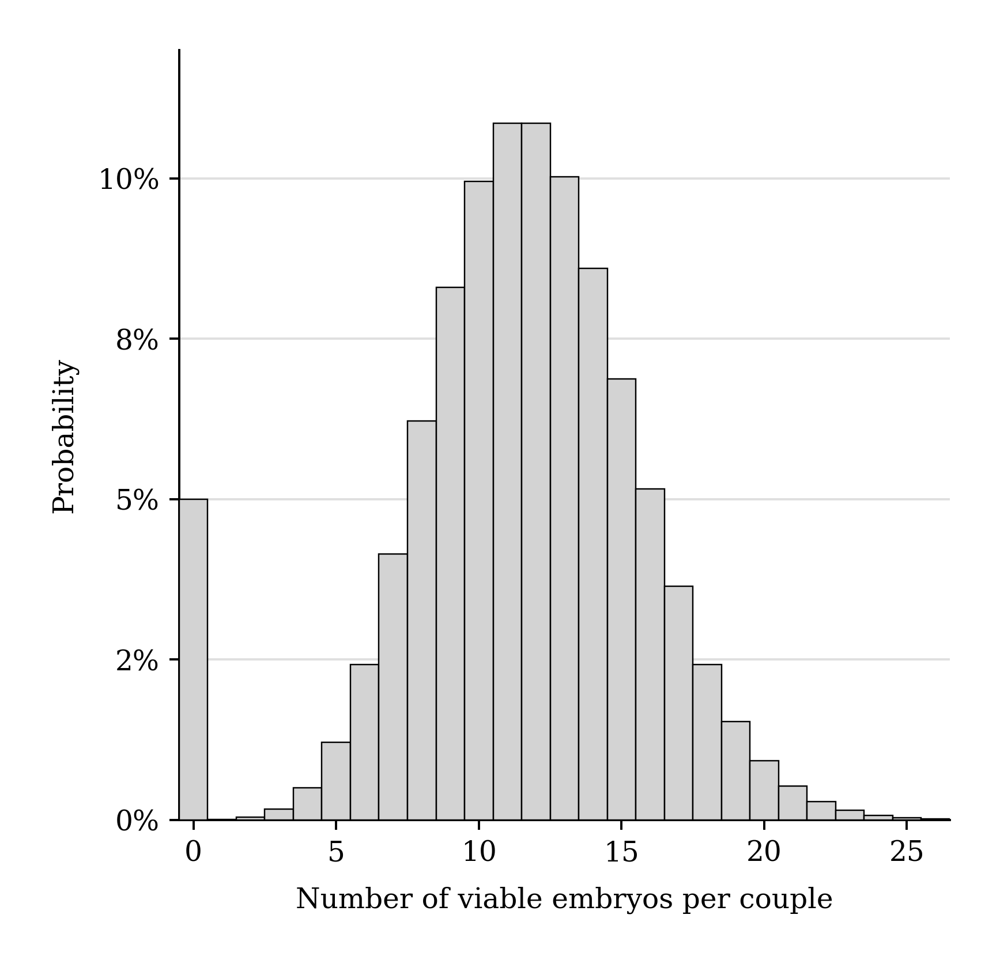

*In our simulation, the number of embryos achieved per couple per IVF cycle is drawn from a Poisson distribution with a mean of 6. Each couple undergoes two rounds of IVF. So, each fertile couple has an average of 12 embryos. 5% of couples are "infertile" and produce no embryos.*

Since parent genomes are phased, we realistically simulate meiosis (assembly of sperm and egg genomes from the parent genome) with [a pedigree simulator (ped-sim)](https://github.com/williamslab/ped-sim), which gives us realistic recombination patterns for offspring genomes. Embryos are generated from the result of these recombinations. Once we have a genome for each embryo, we compute a polygenic score (PGS) for height. We used the PGS created by [Raben et al. (2023)](https://www.nature.com/articles/s41598-023-37580-5). Then, each couple selects the top-scoring embryo for implantation. They transfer one at a time, in order of highest polygenic height score, until they have three live births or run out of embryos. Each embryo-to-uterus transfer has a 65% chance of resulting in a live birth. The babies collectively born from this process constitute the next generation (here, Generation 0's children are together "Generation 1.") Each new generation forms new couples among themselves (avoiding incest going 4 generations back). The next generation undergoes the same process of random mating, IVF, and embryo selection for the height score. We repeat this for eight generations of selection and visualize the results.

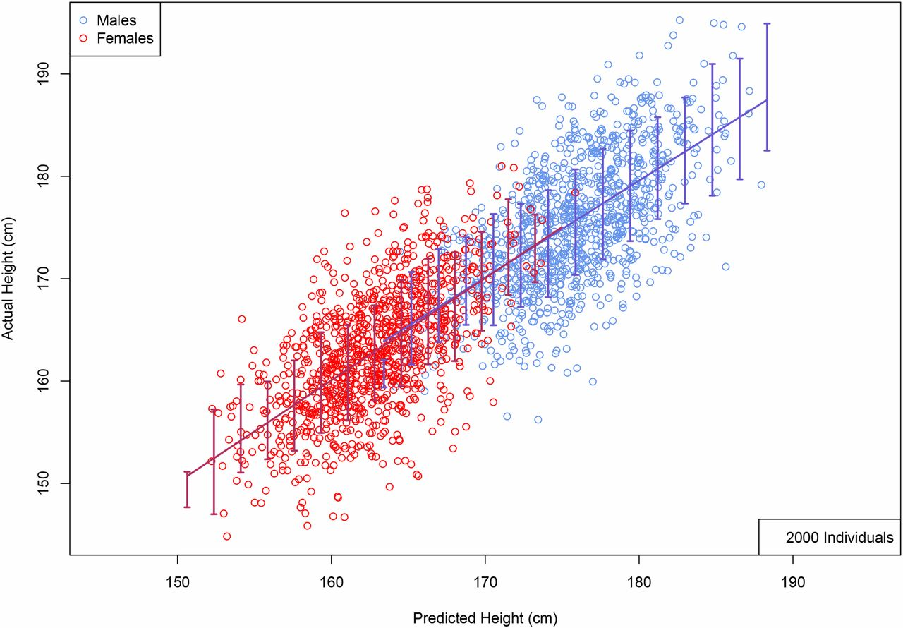

*[Lello et al. (2018)](https://academic.oup.com/genetics/article/210/2/477/5931053) Polygenic height predictors accurately predict adult height to within an inch of error. These predictors capture most of the heredity of height.*

The polygenic score we use integrates thousands of SNPs (single nucleotide polymorphisms, i.e., individual alleles in the human genome which vary in the population). The predictor takes into account only common SNPs (i.e., those that have a minor allele frequency of at least 0.1%). Each SNP of interest is assigned an effect size corresponding to the relative effect of the SNP on height. In the reference population, SNPs with larger effects on height tend to be rarer. The alleles an embryo carries are weighted by their estimated effects on height and then summed to produce its polygenic score.

# Images - presented without much commentary (for now)
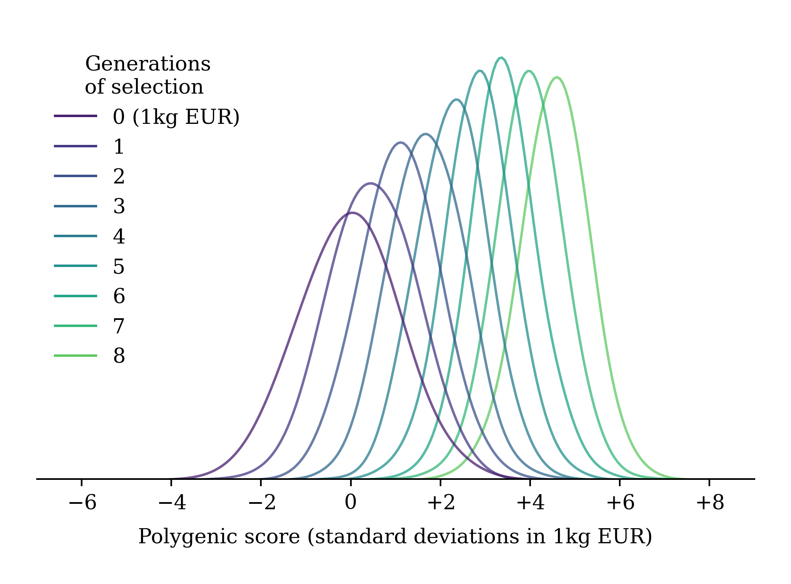

*The program of embryo selection results in increasing levels of the polygenic score from generation to generation.*

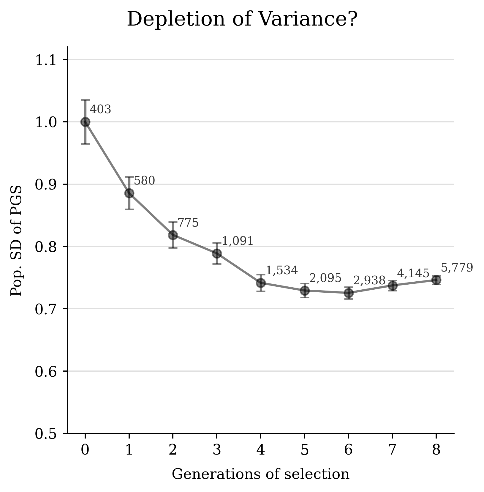

*The polygenic score initially shows depeleted variance but then stabilizes.*

*The effect and frequency of the 20% largest effect-size SNPs in the height PGS. Each line starts at the frequency of the SNP in generation 0 (the original 402 genomes from 1000 Human Henomes project) and ends with a dot at the frequency of the SNP in generation 8. SNPs that have a positive effect on height tend to be swept up in frequency (red lines), while alleles that reduce height tend to be swept down in frequency (blue lines).*

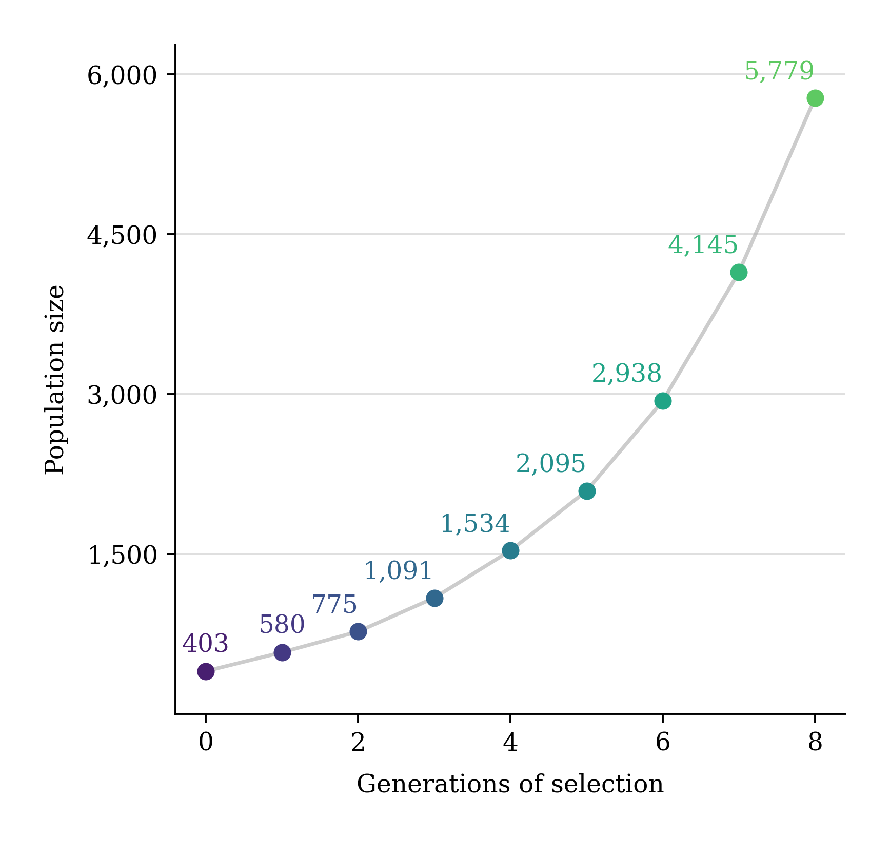

*The populations of the generations increased. Almost all of the fertile couples had 3 live births.*

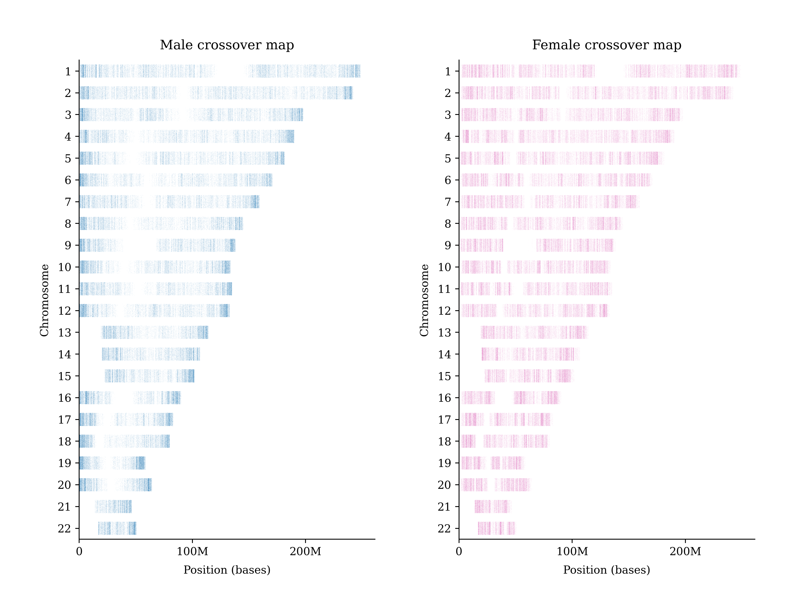

*We were able to realistically simulate meioses using [pedsim](https://github.com/williamslab/ped-sim). Meiotic recombination [is sexually dimorphic](https://github.com/cbherer/Bherer_etal_SexualDimorphismRecombination). Egg recombination points tend to be both more numerous and more evenly distributed across the chromosomes, while sperm recombination points tend to be less numerous and concentrated near the edges of the chromosomes.*

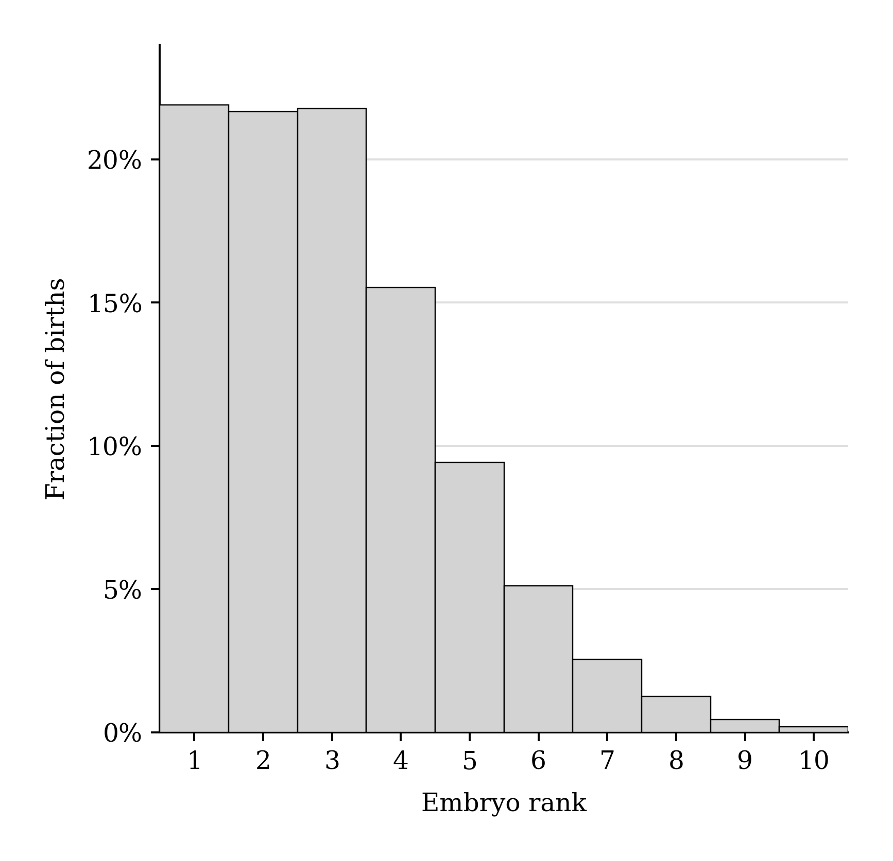

*Each couple transfers one embryo at a time, in order of highest polygenic height score, until they have three live births or run out of embryos. Each transfer has a 65% chance of resulting in a live birth. Above, the members of generations 1-8 are shown according to their initial rank among their parent couple's embryo cohort.*

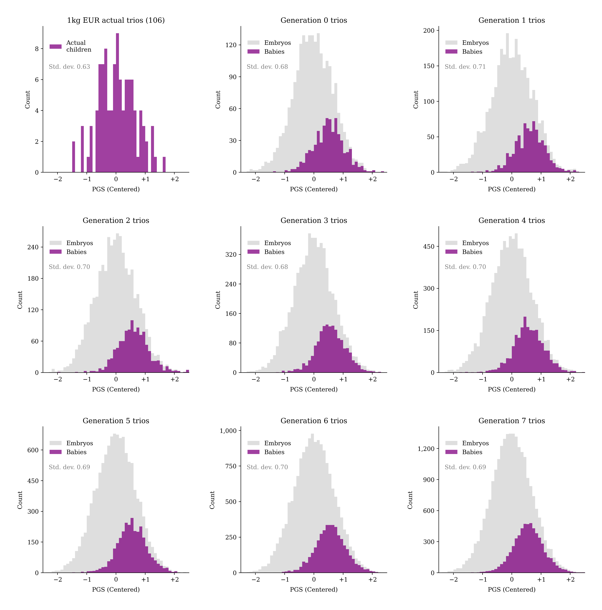

*Babies born tend to be drawn from the top one-third of their parent couple's embryo cohort with respect to polygenic height score.*

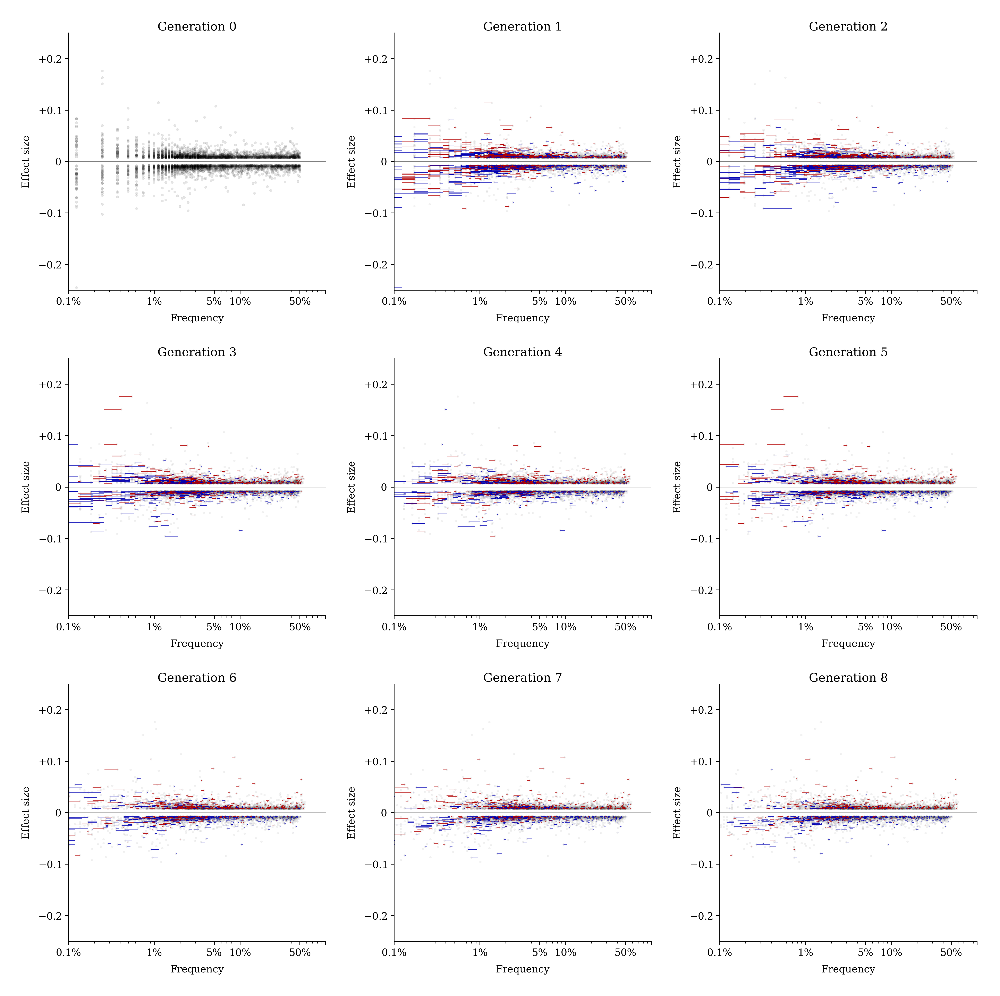

*The frequency of SNPs in the polygenic height predictor shifted between generations as they repeated the process of embryo selection. Alleles correlating with increased height tended to be swept up in frequency (red lines), while alleles correlating with decreased height tended to be swept down in frequency (blue lines).*

 

No issues of consanguinity 8 generations later, the homozygosity has the same distribution in the last generation as in first. There's a big drop in homozygosity between generation 0 and generation 1 due to mating populations randomly across Europea, e.g. Italians mating with British.

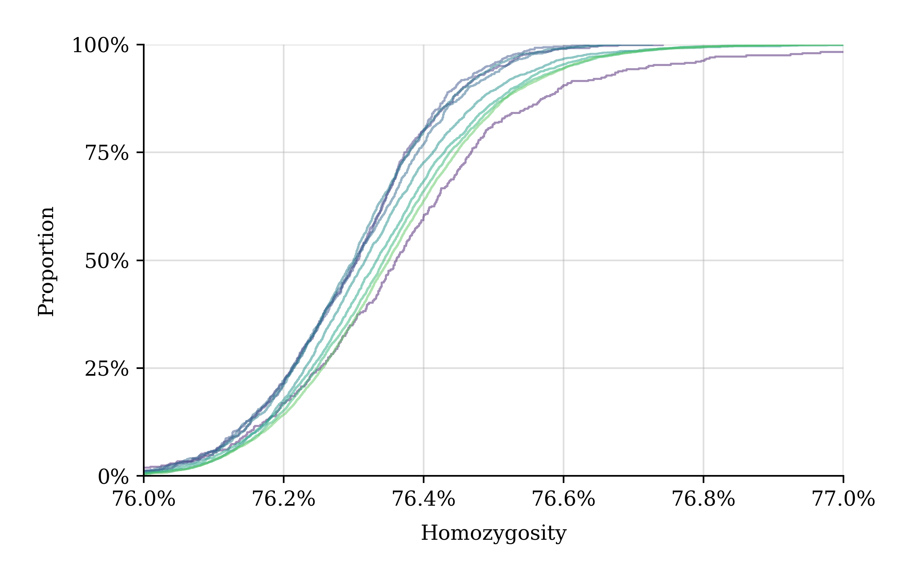

*Embryo selection for height did not significantly increase homozygosity in the population when repeated over many generations (hundreds of years).*

 

The left panel of the chart below shows the fraction of the final generation's genetic material that comes from each founding individual (black dots) as a function of their polygenic score. As expected, the Euroepans with higher polygenic scores pass down more of their DNA to the 8th generation than the Europeans with a low polygenic score, but not by much: the correlation is only 0.09. 

If the DNA of the founders were distributed randomly into their descendants each would contribute only 1/402 of the DNA of the final generation. (402 founders so if it's perfectly fair then each makes up 1/402 of the DNA of the descendants.) You can see that the DNA of the founders is distributed roughly evenly, around 1/402, with some drop outs (as those people were in the 5% of couples that were infertile). 

The right panel of the chart below shows the number of descendants in the final generation containing DNA segments at all from each founder. The average founder passes DNA down to about 2,000 descendants in the 8th generation, some founders' DNA can be found in only ~1,000 people. And again, some do not have any descendants as they or their partner was infertile. 

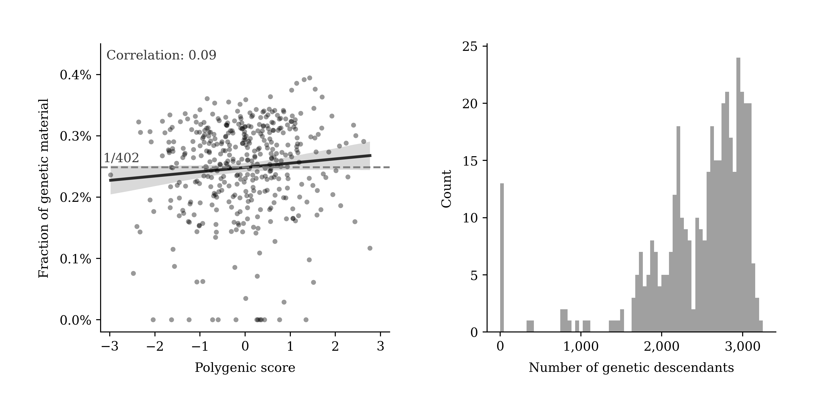

*Embryo selection for height did not significantly decrease an individual’s genetic material from being represented among their descendants when repeated over many generations (hundreds of years).*

