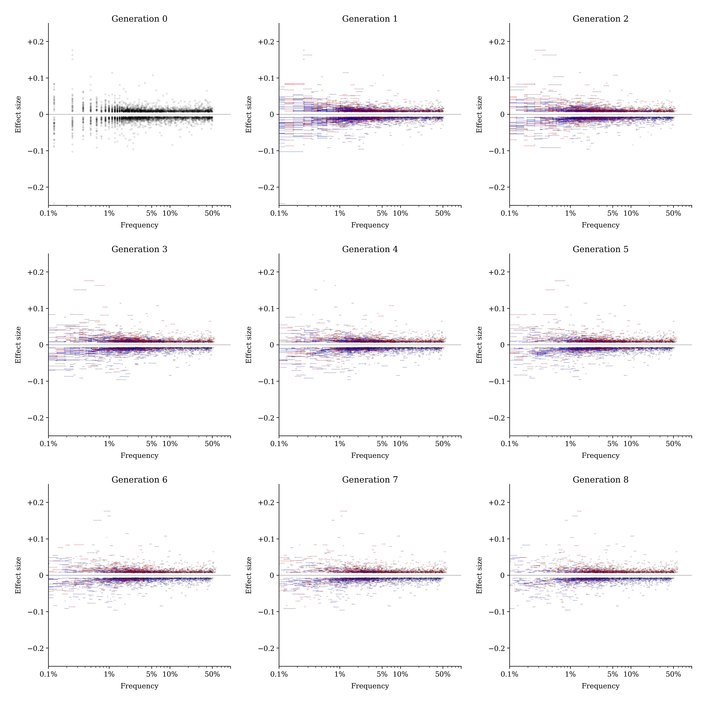
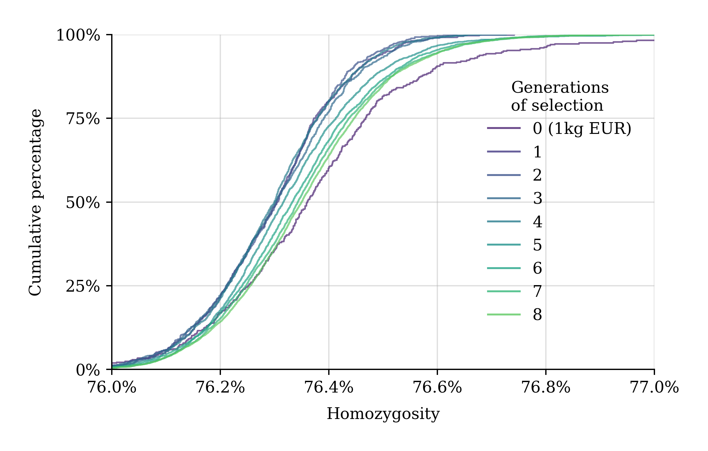

## [Kefitzat haderech](https://en.wikipedia.org/wiki/Kefitzat_haderech)

This is a repository of code and images for an upcoming LessWrong post about embryo selection.

# Background
Much has been said on LW about multiplex gene editing, gametogenesis, artificial wombs, and other paths to genetically advantageous "superbabies." The use of those technologies to alter human genetic material would be an inflection point in human history. But, currently, they are either nonexistent, illegal, unsafe, untested or impossible to implement.
Embryo selection is slow to shift means meaningfully over time; in a given generation it is bounded by the existing genetic material of the parents; it is largely dependent on the number of embryos a couple has. But it can be done right now, legally, in the United States, for relatively cheap.

In the post, we explore embryo selection's effectiveness, consequences and costs. We simulate embryo selection over 8 generations, using real whole human genomes and realistic simulated meioses. For this simulation, we chose height as our trait of interest (the trait embryos are selected for).

We aim to show:
   - Meiosis outcomes, embryo screening and embryo selection can be realistically simulated
   - Embryo selection is effective at raising the likelihood of above-average outcomes with respect to traits of interest, and it is very effective at reducing the likelihood of far-below-average outcomes.
   - Embryo selection for height remains effective in consistently raising generation-to-generation population height when repeated across generations
   - Embryo selection for height does not significantly increase homozygosity in the population when repeated over many generations (hundreds of years). Similarly,
   - Something about altering risks for other diseases?

# The simulation
We start with 403 unrelated, real human genomes from the 1000 Genomes Project. These genomes are whole-genome sequenced and phased. This is our "Generation 0." To simulate reproduction, we pair them randomly into male/female couples. Each couple then performs IVF and embryo selection. Specifically, each couple gets two IVF cycles. The number of embryos achieved per cycle is drawn from a Poisson distribution with a mean of 6. So, on average, each fertile couple has about 12 embryos. 5% of couples are infertile and produce no embryos. Since parent genomes are phased, we realistically simulate meiosis using pedsim, which gives us realistic recombination patterns for offspring genomes. Embryos are generated from the result of these recombinations.Once we have a genome for each embryo, we compute a polygenic score (PGS) for height. This score comes from Raben. Then, each couple selects embryos for implantation. They transfer one at a time, in order of highest polygenic height score, until they have three live births or run out of embryos. Each transfer has a 65% chance of resulting in a live birth. The babies collectively born from this process constitute the next generation (here, Generation 0's children are together "Generation 1.") Each new generation forms new couples among themselves (avoiding incest). Then they undergo same process of IVF, selection and birth of the next generation. We repeat until we reach Generation 8.

# Images

(above) Polygenic height predictors accurately forecast adult height for both men and women. These predictors capture almost all of the heredity of height. [citation]

The polygenic score we use integrates hundreds of SNPs (single nucleotide polymorphisms--individual positions in the human genome that vary among people). The predictor takes into account only common SNPs (i.e., those that have a minor allele frequency of at least 1%). Each SNP of interest is assigned an effect sixze corresponding to the relative effect of the SNP on height. The plot above shows the relationship between the frequency (in the reference population---our generation 0) of SNPs in the height predictor, and their effect size. In the reference population, SNPs with higher effect sizes tend to be rarer. The polygenic score is calculated by multiplying the effect size of each SNP by the number of copies each individual has (0, 1 or 2) to produce a single number.

(above) The program of repeated embryo selection results in increased heights from generation to generation.

(above) From generation 0 (the original 403 genomes from 1000 Human Henomes project) to generation 8, SNPs correlating with increased height tended to be swept up in frequency (red lines), while alleles correlating with decreased height tended to be swept down in frequency (blue lines).

(above) The populations of the generations increased. Almost all of the fertile couples had 3 live births. 

(above) We were able to realistically simulate meioses using pedsim [link]. Sperm and eggs undergo meiosis differently---egg recombination points tend to be both more numerous and more evenly distributed across the chromosomes, while sperm ercombination points tend to be less numerous and concentrated near the edges of the chromosomes.

(above) In our simulation, the number of embryos achieved per couple per IVF cycle is drawn from a Poisson distribution with a mean of 6. Each couple undergoes two rounds of IVF. So, on average, each fertile couple has about 12 embryos. 5% of couples are infertile and produce no embryos.

(above) In our simulation, each couple transfers one embryo at a time, in order of highest polygenic height score, until they have three live births or run out of embryos. Each transfer has a 65% chance of resulting in a live birth. Above, the members of generations 1-8 are shown according to their initial rank among their parent couple's embryo cohort.

(above) In our simulation, babies born tend to be drawn from the top one-third of their parent couple's embryo cohort with respect to polygenic height score.

(above) In our simulation, the frequency of SNPs in the polygenic height predictor shifted between generations as they repeated the process of embryo selection. Alleles correlating with increased height tended to be swept up in frequency (red lines), while alleles correlating with decreased height tended to be swept down in frequency (blue lines).

