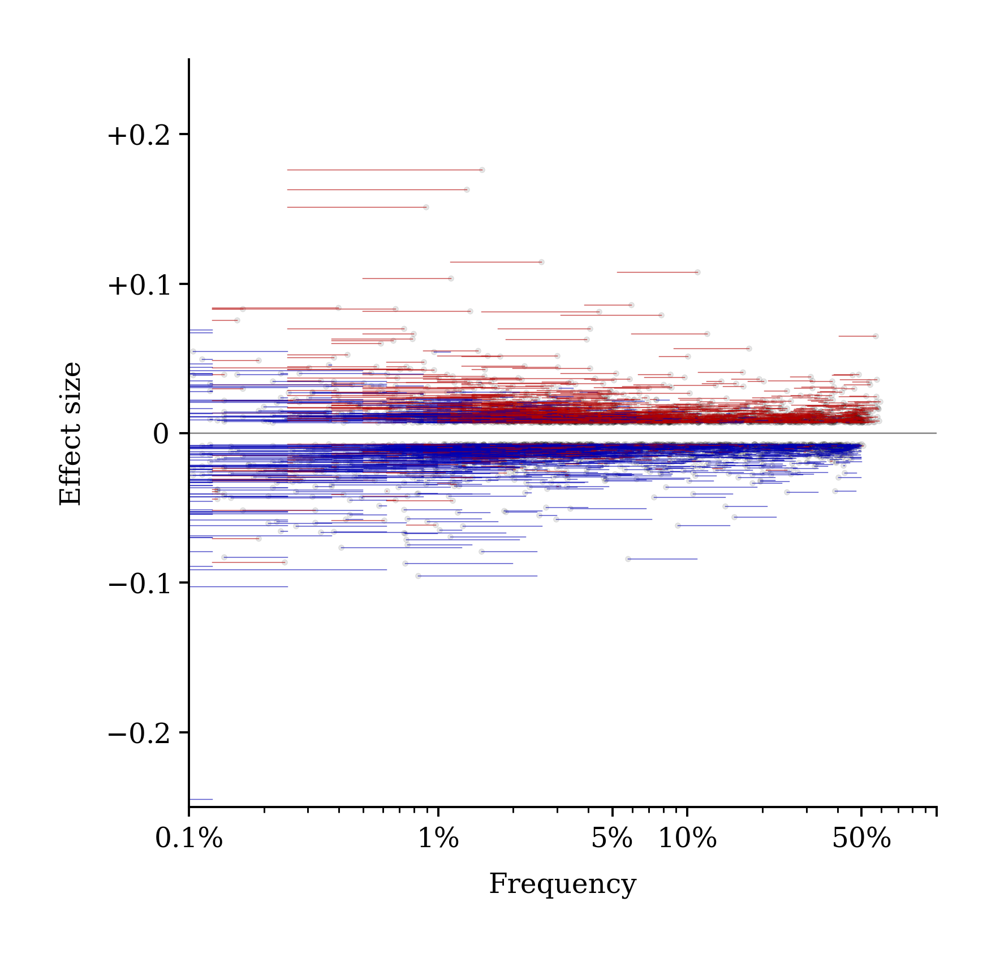

## [Kefitzat haderech](https://en.wikipedia.org/wiki/Kefitzat_haderech)

This is a repository of code and images for an upcoming LessWrong post about embryo selection.

## Background

Much has been said on LW about multiplex gene editing, gametogenesis, artificial wombs, and other paths to genetically advantageous "superbabies." The use of those technologies to alter human genetic material would be an inflection point in history. But, currently, they are either nonexistent, illegal, unsafe, untested or otherwise unimplementable.

Embryo selection, by comparison, is unsexy - it takes generations to meaningfully shift average trait-levels of a population; and the benefits to parents are bounded by their existing genetic material and the number of embryos they have. Unlike more advanced genetic technologies, embryo selection is already available today—legal, accessible, and relatively affordable within the United States healthcare system.

[(above image from “How to Make Superbabies”)](https://www.lesswrong.com/posts/DfrSZaf3JC8vJdbZL/how-to-make-superbabies)

In our post, we explore embryo selection's effectiveness and consequences with a fun simulation. We simulate embryo selection over 9 generations, using real whole human genomes and realistic meioses. For this simulation, we chose height as the trait that the embryos are selected for.

We show:
  - Population-scale embryo selection can be realistically simulated.
  - When embryo selection for a trait is widespread and carried out over generations, the population average can be shifted by multiple times the original standard deviation without harming genetic variance or raising homozygosity (normally caused by inbreeding).
  - Embryo selection for couples having three children tends to provide them with embryos in roughly the top third of the distribution of estimated polygenic contribution to the selected trait.
  <!-- - Embryo selection can be performed without significant side effects to other polygenic scores (except where the trait of interest causally influences those traits) -->

## The simulation

We start with the genomes of 403 unrelated European-ancestry individuals available in the public domain by the [1000 Genomes Project](https://www.internationalgenome.org/data-portal/data-collection/30x-grch38). These are the full genomes of actual people recruited in the 1980s from Italy, Spain, Great Britain, and 'Central Europeans' in Utah [(i.e. mormons)](https://www.bostonreview.net/articles/duana-fullwiley-dna-and-our-twenty-first-century-ancestors/). 

We imagine a scenario like the TV show Lost where these individuals are stranded on an island, or perhaps are colonizers of Mars stranded on the distant red planet. Wherever they are, we suppose that they are fully equipped with the technology for in vitro fertilization (IVF) and embryo screening.

These people make up our 0th generation. To simulate reproduction, we randomly pair 402 of them into 201 male/female couples. On this island, sex is for fun, but [IVF is for babies](https://ivfisforbabies.com/). So each couple elects to undergo two cycles of IVF.

The number of viable embryos retrieved per IVF cycle is [realistically simulated](https://doi.org/10.1186/s43043-019-0004-z) by a Poisson distribution with an average of [6 viable embryos](https://portal.orchidhealth.com/embryo-calculator). Therefore, two cycles yields an average of 12 embryos for a couple. About 5% of couples find themselves infertile, retrieving 0 viable embryos.

*In our simulation, the number of embryos achieved per couple per IVF cycle is drawn from a Poisson distribution with a mean of 6. Each couple undergoes two rounds of IVF. So, each fertile couple has an average of 12 embryos. 5% of couples are "infertile" and produce no embryos.*

Since parent genomes are phased, we realistically simulate meiosis (assembly of sperm and egg genomes from the parent genome) with [a pedigree simulator (ped-sim)](https://github.com/williamslab/ped-sim), which gives us realistic recombination patterns for offspring genomes. Embryos are generated from the result of these recombinations. Once we have a genome for each embryo, we compute a polygenic score (PGS) for height. We used the PGS created by [Raben et al. (2023)](https://www.nature.com/articles/s41598-023-37580-5). Then, each couple selects the top-scoring embryo for implantation. They transfer one at a time, in order of highest polygenic height score, until they have three live births or run out of embryos. Each embryo-to-uterus transfer has a 65% chance of resulting in a live birth. The babies collectively born from this process constitute the next generation (here, Generation 0's children are together "Generation 1.") Each new generation forms new couples among themselves (avoiding incest going 4 generations back). The next generation undergoes the same process of random mating, IVF, and embryo selection for the height score. We repeat this for eight generations of selection and visualize the results.

*[Lello et al. (2018)](https://academic.oup.com/genetics/article/210/2/477/5931053) Polygenic height predictors accurately predict adult height to within an inch of error. These predictors most of the heredity of height.*

The polygenic score we use integrates thousands of SNPs (single nucleotide polymorphisms, i.e., individual alleles in the human genome that vary in the population). The predictor takes into account only common SNPs (i.e., those that have a minor allele frequency of at least 0.1%). Each SNP of interest is assigned an effect size corresponding to the relative effect of the SNP on height. In the reference population, SNPs with larger effects on height tend to be rarer. The alleles an embryo carries are weighted by their estimated effects on height and then summed to produce its polygenic score.

## Images

*The program of repeated embryo selection results in increasing levels of the polygenic score from generation to generation.*

*The effect and frequency of the 20% largest effect-size SNPs in the height PGS. Each line starts at the frequency of the SNP in generation 0 (the original 403 genomes from 1000 Human Henomes project) and ends with a dot at the frequency of the SNP in generation 8. SNPs that have a positive effect on height tend to be swept up in frequency (red lines), while alleles that reduce height tend to be swept down in frequency (blue lines).*

*The populations of the generations increased. Almost all of the fertile couples had 3 live births.*

*We were able to realistically simulate meioses using [pedsim](https://github.com/williamslab/ped-sim). Meiotic recombination [is sexually dimorphic](https://github.com/cbherer/Bherer_etal_SexualDimorphismRecombination). Egg recombination points tend to be both more numerous and more evenly distributed across the chromosomes, while sperm recombination points tend to be less numerous and concentrated near the edges of the chromosomes.*

*In our simulation, each couple transfers one embryo at a time, in order of highest polygenic height score, until they have three live births or run out of embryos. Each transfer has a 65% chance of resulting in a live birth. Above, the members of generations 1-8 are shown according to their initial rank among their parent couple's embryo cohort.*

*In our simulation, babies born tend to be drawn from the top one-third of their parent couple's embryo cohort with respect to polygenic height score.*

*In our simulation, the frequency of SNPs in the polygenic height predictor shifted between generations as they repeated the process of embryo selection. Alleles correlating with increased height tended to be swept up in frequency (red lines), while alleles correlating with decreased height tended to be swept down in frequency (blue lines).*

*In our simulation, embryo selection for height did not significantly increase homozygosity in the population when repeated over many generations (hundreds of years).*

*In our simulation, embryo selection for height did not significantly decrease an individual’s genetic material from being represented among their descendants when repeated over many generations (hundreds of years).*

